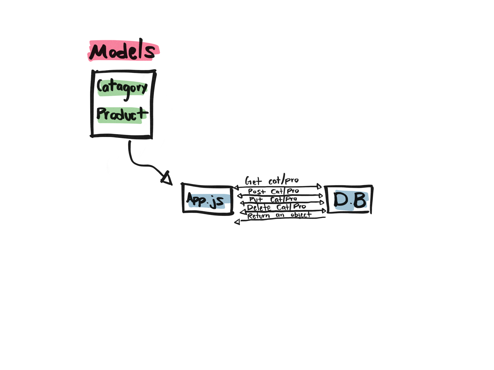

# LAB - 08

## Express Routing & Connected API

### Author: Brandyn Vay

### Links and Resources
* [submission PR](https://github.com/brandyn-vay-401-advanced-javascript/lab-class-08)
* [travis](https://travis-ci.com/brandyn-vay-401-advanced-javascript/lab-class-08)

### Modules
#### `categories-schema.js`
#### `categories.js`
#### `products-schema.js`
#### `products-schema.js`
#### `app.js`
##### Exported Values and Methods

### Setup
#### `.env` requirements
* `PORT` - 3000
* `MONGODB_URI` - MONGODB_URI=mongodb://localhost:27017/`database name`
  
#### Tests
* How do you run tests? Run npm test in the terminal.

#### UML
